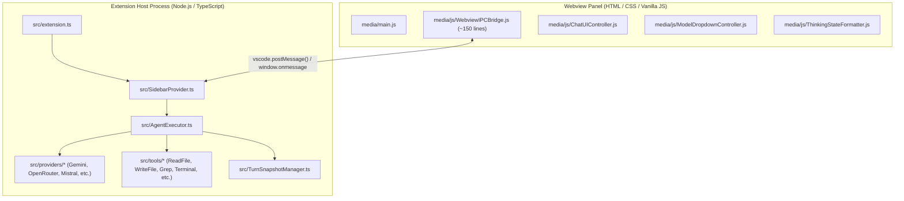

# KAI Agent - Extension Architectural Overview & System Design

This document details the architecture, component roles, and file-by-file specifications for the **KAI Agent VS Code & Antigravity IDE Extension** (`Kai-Agent-extension/`).

---

## 1. Extension Runtime Architecture

The Extension is hosted inside VS Code / Antigravity IDE and operates across two isolated process boundaries:

---

## 2. Dedicated Extension File Roles & Differences vs. Desktop App

| Extension File Path | Primary Role in Extension | Differences & Architectural Boundary vs. Desktop App |
| :--- | :--- | :--- |
| **`code/media/js/WebviewIPCBridge.js`** | **Lean Extension IPC Bridge (~150 lines)**. Forwards UI actions directly to the Extension Host via `this.vscode.postMessage(message)` and dispatches incoming host events. | **NO Fallback Engine**: Does **NOT** contain client-side API fetch loops, SSE stream readers, or browser tool implementations. Unlike the Desktop App (which has ~1400 lines of `_handleClientSideIPC` for standalone browser testing), the Extension delegates 100% of LLM streaming and tool executions to the Extension Host in TypeScript. |
| **`code/media/main.js`** | **Extension Webview UI Controller**. Initializes the single-column webview interface, binds header buttons, and manages panel tabs. | **NO Sidebar Management**: The Extension has **NO Left Sidebar** (no permanent chat history panel or desktop window controls). Navigation is handled exclusively via the compact top Header and Input Card dock. |
| **`code/media/main.css`** | **Extension Webview Stylesheet**. Uses native VS Code CSS variables (`var(--vscode-editor-background)`, `var(--vscode-font-family)`, etc.) for theme integration. | **Scoped Container Styles**: Contains styles tailored for VS Code's narrow sidebar / webview panel layout. Does not contain desktop titlebar drag regions or desktop multi-column grid layouts. |
| **`code/src/SidebarProvider.ts`** | **Extension Webview Host & CSP Provider**. Creates the `vscode.WebviewView`, injects CSP nonces, loads HTML/JS assets, and routes IPC messages between Webview and backend. | **VS Code Specific**: Exists only in the Extension. Replaces Desktop's `AppHost.ts` and `preload.ts`. |
| **`code/src/AgentExecutor.ts`** | **Backend Tool Dispatch & Agent Loop Engine**. Handles iterative agent steps, executes mutating tools with snapshot backups, and streams tokens back to webview. | Operates directly on the local workspace via Node.js `fs` and VS Code Workspace APIs (`vscode.workspace`). |
| **`code/src/providers/*`** | **Dedicated LLM Provider Classes**. Dedicated TypeScript clients (`GeminiClient`, `OpenRouterClient`, `LMStudioClient`, `MistralClient`, `CohereClient`, `CerebrasClient`, `ZhipuClient`, `OmniRouteClient`). | Shares 100% OOP interface parity with Desktop App backend, executing securely in Node.js. |
| **`code/media/js/ThinkingStateFormatter.js`** | **Dynamic Thinking & Reasoning Resolver**. Resolves per-model reasoning options (e.g. `stealth/ox-alpha`, `z-ai/glm-5.2`, `inkling`) and formats Gemini `Minimal` labels. | 100% shared across Extension and Desktop App renderer for consistent model capability rendering. |
| **`code/media/js/ModelDropdownController.js`** | **Model Selector Dropdown Manager**. Manages dropdown accordion, live LM Studio status dots, and cloud provider API key indicators. | Optimized for compact Extension webview dropdown menus without sidebar dependencies. |

---

## 4. CSS Architecture & Strict Prohibition of `!important`
- **Zero `!important` Policy**: The use of `!important` is strictly prohibited across all stylesheets. Proper specificity, object-oriented CSS patterns, and clean cascading rules are required.
- **Single Source of Truth**: All shared tokens must reside in `:root` and theme overrides, with exact single base classes per UI component.

---

## 5. Triple-File Documentation Synchronization Mandate
Whenever architecture, UI components, runtime features, or system design guidelines are modified, all 3 `AGENTS.md` and all 3 `overview.md` files must be updated simultaneously in lockstep:
1. Root workspace: `.agents/AGENTS.md` and `.agents/overview.md`
2. Desktop App: `KAI Agent App/.agents/AGENTS.md` and `KAI Agent App/docs/overview.md`
3. Extension: `Kai-Agent-extension/.agents/AGENTS.md` and `Kai-Agent-extension/docs/overview.md`

4. **Localization Parity**:
   - Maintains 100% dictionary key parity with `AllLocales.js` across all 18 languages.
